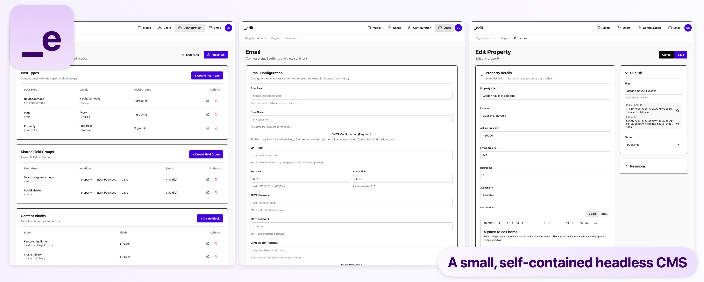

# _edit CMS

A small, self-contained headless CMS for PHP hosting, with a Vue admin and SQLite storage.



- Custom content types, field groups, repeaters and flexible content blocks
- Rich text, media, relationships and typed content queries
- Drafts, publishing and revision restore
- Administrator/editor roles and one-time installation codes
- Local ALTCHA contact-form verification and SMTP delivery
- Validated configuration imports and full backup/restore tools

## Run locally

Use PHP 8.4 (tested), with PDO SQLite, SQLite3, fileinfo, OpenSSL, DOM and Zip extensions. Building the admin requires Node.js 22.12+ and npm; `.nvmrc` selects Node 24.

```sh
make install
make develop
```

Open http://localhost:5173/_edit/admin/. For a fresh installation, run `php _edit/core/Operations/setup.php` and enter its one-time code to create the first administrator.

## Build and deploy

```sh
bash build.sh
```

The complete package is `dist/_edit-dev.zip`. Successful pushes to `main` also publish a versioned ZIP and checksums in [GitHub Releases](https://github.com/weatherjean/editcmsb/releases). PHP libraries and browser assets ship locally; the host needs neither Node.js nor Composer. See [deployment](DEPLOYMENT.md) for server rules, setup and upgrades, and [development](DEVELOPMENT.md) for architecture and tests.

## Configuration

Manage JSON modules, field groups and blocks in the admin. Imports validate the entire configuration and activate a complete snapshot. After the first change, use the interface/API rather than editing the original JSON files. See [upgrade notes](DEPLOYMENT.md#upgrade-and-recovery).

Public content is served at `/_edit/api/public/{type}`. The admin includes [API documentation](_edit/admin-source/PUBLIC-API.md). [Contact form integration](DEPLOYMENT.md#contact-forms) includes a locally bundled example.

## Scope and verification

Designed for a small editorial team on a single PHP/SQLite server. The real-estate content in the preview is demo data; the public website is a separate application.

The repository includes isolated regression tests for content, permissions, contact forms, deployment boundaries and recovery. See [test commands and limitations](DEVELOPMENT.md#tests).

## License

MIT for project code. Vendored libraries retain their upstream licenses, included beside the PHP sources and in the built admin assets.
